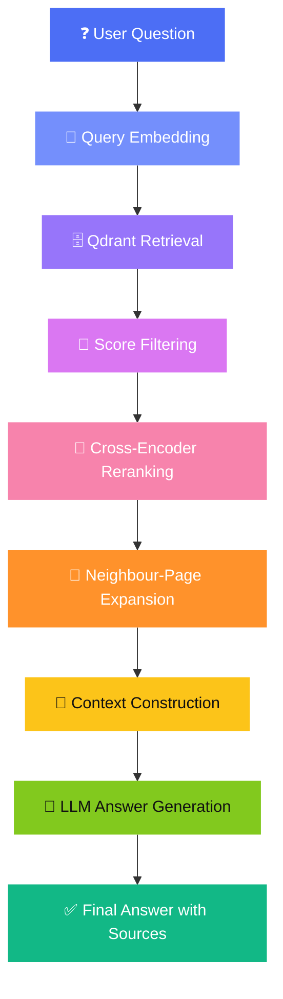
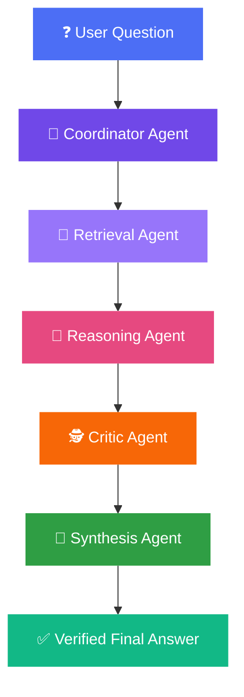
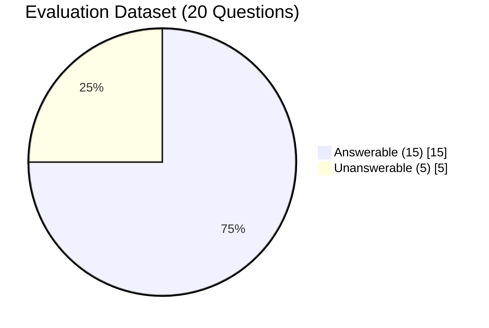
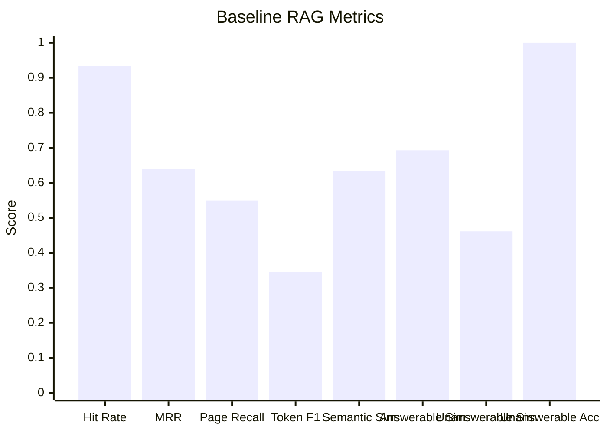
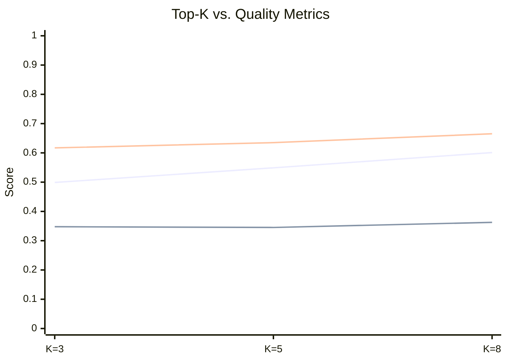
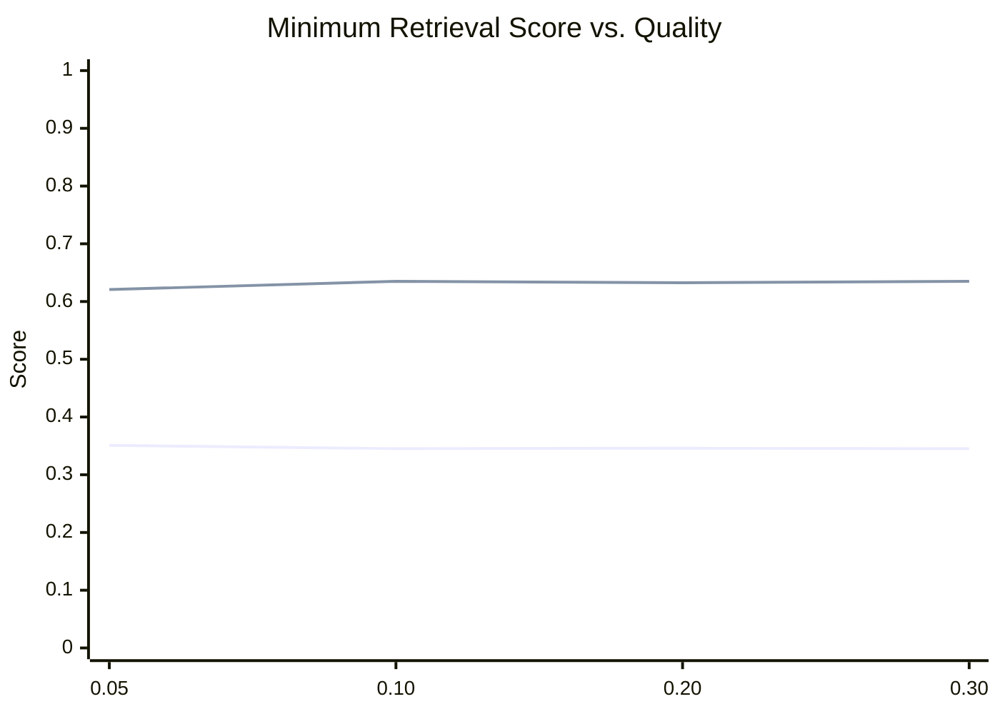
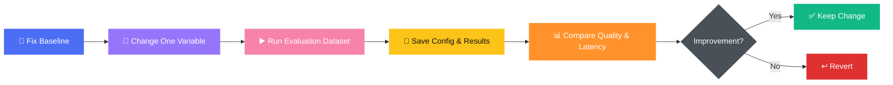

<div align="center">

# 🔗 COA–RAG–Ops Lab

### A local, production-oriented lab for comparing Standard RAG vs. Chain of Agents


*No paid cloud services. No proprietary APIs. Just RAG, agents, evaluation, and observability — running entirely on your machine.*

</div>

---

## 🎯 Project Goals

| Goal | Description |
|---|---|
| 📄 | Build a reliable document-question-answering system |
| ⚖️ | Compare standard RAG with a Chain of Agents pipeline |
| 🧠 | Reduce hallucinations via answerability checks and evidence verification |
| 📊 | Measure retrieval quality, answer quality, and latency |
| 🔧 | Experiment with chunking, reranking, thresholds, and context selection |
| 🏗️ | Apply practical MLOps/LLMOps: evaluation, experiment tracking, testing, versioning |

---

## ✅ Current Status

<table>
<tr>
<td valign="top" width="50%">

**Ingestion & Retrieval**
- ✅ PDF upload & text extraction
- ✅ Fixed-size & semantic chunking
- ✅ Sentence-transformer embeddings
- ✅ Qdrant vector storage
- ✅ Cross-encoder reranking
- ✅ Neighbour-page retrieval

</td>
<td valign="top" width="50%">

**Reasoning & Evaluation**
- ✅ Standard RAG QA
- ✅ Adaptive retrieval planning
- ✅ Chain of Agents orchestration
- ✅ Claim-level evidence verification
- ✅ Answerability handling
- ✅ Evaluation datasets & experiment comparison
- ✅ Retrieval/generation/total latency tracking

</td>
</tr>
</table>

---

## 🧰 Technology Stack

| Layer | Technology |
|---|---|
| 🖥️ Backend | `FastAPI` |
| 🐍 Language | `Python` |
| 🕸️ Agent Orchestration | `LangGraph` |
| 🦙 Local LLM Runtime | `Ollama` |
| 💬 Answer Model | `llama3.2:3b` |
| 🧭 Planner Model | `llama3.2:1b` |
| 🔡 Embedding Model | `sentence-transformers/all-MiniLM-L6-v2` |
| 🎯 Reranker | `cross-encoder/ms-marco-MiniLM-L-6-v2` |
| 🗄️ Vector Database | `Qdrant` |
| 📑 PDF Extraction | `PyPDF` + `Tesseract OCR` |
| 🧪 Testing | `Pytest` |
| 📘 API Docs | `Swagger UI / OpenAPI` |

---

## 🏗️ System Architecture

### Standard RAG Pipeline



### Chain of Agents Pipeline



### 🧩 Agent Responsibilities

| Agent | Responsibility |
|---|---|
| 🧭 **Coordinator** | Controls the workflow and passes shared state between agents |
| 🔎 **Retrieval** | Retrieves relevant chunks; records confidence and latency |
| 🧠 **Reasoning** | Produces structured claims, each citing supporting chunk IDs |
| 🕵️ **Critic** | Checks each claim against its cited evidence only — supported, unsupported, or uncertain |
| 🧵 **Synthesis** | Uses verified claims + critic feedback to build the final response |

---

## 📁 Project Structure

```
coa-rag-ops-lab/
├── backend/
│   ├── app/
│   │   ├── agents/
│   │   │   ├── coordinator_agent.py
│   │   │   ├── retrieval_agent.py
│   │   │   ├── reasoning_agent.py
│   │   │   ├── critic_agent.py
│   │   │   ├── synthesis_agent.py
│   │   │   └── state.py
│   │   ├── api/v1/
│   │   │   ├── upload.py
│   │   │   ├── rag_router.py
│   │   │   ├── rag_eval_router.py
│   │   │   ├── coa_router.py
│   │   │   └── coa_eval_router.py
│   │   ├── services/
│   │   │   ├── chunking_service.py
│   │   │   ├── coa_evaluation_service.py
│   │   │   ├── evaluation_service.py
│   │   │   ├── experiment_service.py
│   │   │   ├── llm_service.py
│   │   │   ├── metrics_service.py
│   │   │   ├── pdf_service.py
│   │   │   ├── planner_service.py
│   │   │   ├── qdrant_service.py
│   │   │   ├── rag_service.py
│   │   │   └── reranker_service.py
│   │   ├── config.py
│   │   └── main.py
│   ├── scripts/run_evaluation.py
│   ├── tests/
│   │   ├── test_coa.py
│   │   └── test_planner.py
│   ├── data/evaluation/evaluation_dataset.json
│   └── requirements.txt
├── docs/
├── .gitignore
└── README.md
```
> ℹ️ The exact file structure may change as the project evolves.

---

## ⚙️ Prerequisites

- 🐍 Python 3.10+
- 🐳 Docker Desktop
- 🦙 Ollama
- 🔧 Git
- 🔤 Tesseract OCR *(only if processing scanned PDFs)*

---

## 🚀 Installation

**1. Clone the repository**
```bash
git clone <repository-url>
cd coa-rag-ops-lab
```

**2. Create a virtual environment**

Windows PowerShell:
```powershell
python -m venv backend/.venv
Set-ExecutionPolicy -Scope Process -ExecutionPolicy RemoteSigned
& "backend/.venv/Scripts/Activate.ps1"
```

Linux / macOS:
```bash
python3 -m venv backend/.venv
source backend/.venv/bin/activate
```

**3. Install dependencies**
```bash
pip install -r backend/requirements.txt
```

**4. Download the local models**
```bash
ollama pull llama3.2:1b
ollama pull llama3.2:3b
ollama list   # confirm installation
```

**5. Start Qdrant**
```bash
docker run -d \
  --name qdrant \
  -p 6333:6333 \
  -p 6334:6334 \
  -v qdrant_storage:/qdrant/storage \
  qdrant/qdrant
```
> Windows PowerShell (single line):
> `docker run -d --name qdrant -p 6333:6333 -p 6334:6334 -v qdrant_storage:/qdrant/storage qdrant/qdrant`

**6. Start the FastAPI server**
```bash
cd backend
uvicorn app.main:app --reload
```

| Resource | URL |
|---|---|
| 🌐 API | http://127.0.0.1:8000 |
| 📘 Swagger Docs | http://127.0.0.1:8000/docs |

---

## 🔧 Configuration

Set in `backend/app/config.py` or via environment variables:

```env
QDRANT_HOST=localhost
QDRANT_PORT=6333
EMBEDDING_MODEL=sentence-transformers/all-MiniLM-L6-v2
LLM_MODEL=llama3.2:3b
PLANNER_MODEL=llama3.2:1b
CHUNKING_METHOD=semantic
TOP_K=5
MIN_RETRIEVAL_SCORE=0.10
RERANKING_ENABLED=true
NEIGHBOUR_PAGE_WINDOW=1
```

---

## 📡 Using the API

### 1️⃣ Upload a PDF
Use the upload endpoint in Swagger UI. The pipeline will:


Collections used: `pdf_chunks_fixed`, `pdf_chunks_semantic`

### 2️⃣ Ask a Standard RAG Question
```json
{
  "question": "What is LangGraph?",
  "top_k": 5,
  "min_retrieval_score": 0.1,
  "chunking_method": "semantic",
  "adaptive": false
}
```

### 3️⃣ Ask a Chain of Agents Question
```json
{
  "question": "What is LangGraph?",
  "top_k": 5,
  "min_retrieval_score": 0.1,
  "chunking_method": "semantic"
}
```

**Response may include:** retrieved chunks · retrieval confidence · structured claims · evidence chunk IDs · critic decisions & feedback · final answer · per-stage latency

---

## 🧭 Adaptive Retrieval Planner

Classifies the question and auto-selects retrieval settings.

**Supported query types:** `factoid` · `explanation` · `broad` · `general`

| Setting | Allowed Values |
|---|---|
| `top_k` | 3, 5, 8 |
| Retrieval threshold | 0.05, 0.10, 0.20 |
| Chunking method | fixed, semantic |
| Neighbour window | 0, 1, 2 |

**Fallback configuration:**
```json
{
  "query_type": "general",
  "top_k": 5,
  "min_retrieval_score": 0.1,
  "chunking_method": "semantic",
  "neighbor_window": 1
}
```

---

## 🧩 Context Selection Optimisation

| Question Type | Chunks Used |
|---|---|
| Simple definition / authorship | up to **3** |
| Explanation / architecture / routing / complex | up to **5** |

This reduces unnecessary context while protecting evidence for complex questions.

---

## 🛡️ Answerability & Hallucination Control

For unsupported questions, the system avoids inventing an answer and instead responds:

> *"The provided documents do not contain enough information to answer this question."*

The Chain of Agents pipeline adds an extra safety layer: claims must cite evidence, and a critic agent checks those claims.

---

## 📊 Evaluation Dataset



Example evaluation request:
```json
{
  "dataset_path": "data/evaluation/evaluation_dataset.json",
  "top_k": 5,
  "min_retrieval_score": 0.1,
  "chunking_method": "semantic",
  "adaptive": false
}
```

---

## 📈 Evaluation Metrics

### Retrieval Metrics
- **Hit Rate** — `Questions with ≥1 relevant result / Total answerable questions`
- **Mean Reciprocal Rank (MRR)** — `1 / Rank of first relevant result`, averaged (rank 1 → 1.0, rank 5 → 0.2)
- **Page Recall** — how many expected pages appear in retrieved context

### Answer Metrics
Exact Match · Token F1 · Semantic Similarity · Answerable Similarity · Unanswerable Similarity · Unanswerable Accuracy

### Latency Metrics
Embedding → Vector Retrieval → Score Filtering → Reranking → Neighbour Retrieval → Reasoning → Critic Verification → Final Generation → **Total Pipeline**

---

## 🏆 Baseline Results

*Standard RAG · semantic chunking · `top_k=5` · `min_retrieval_score=0.10`*



| Metric | Result |
|---|---|
| 🎯 Retrieval Hit Rate | **0.9333** |
| 🥇 MRR | **0.6389** |
| 📄 Mean Page Recall | **0.5489** |
| ✅ Mean Exact Match | 0.0000 |
| 🔤 Mean Token F1 | ≈ 0.3452 |
| 🧬 Mean Semantic Similarity | ≈ 0.6350 |
| ✔️ Answerable Similarity | ≈ 0.6927 |
| 🚫 Unanswerable Similarity | ≈ 0.4616 |
| 🛡️ Unanswerable Accuracy | **1.0000** |

> ⚠️ These are experiment results, not fixed guarantees — they may shift with dataset, prompts, models, or retrieval configuration.

---

## 🔬 Retrieval Experiments

### Top-K Comparison



| Top K | Page Recall | Token F1 | Semantic Similarity |
|---|---|---|---|
| 3 | 0.4989 | 0.3477 | 0.6171 |
| **5** | **0.5489** | 0.3452 | 0.6350 |
| 8 | 0.6011 | 0.3627 | 0.6652 |

> 📌 A larger `top_k` can improve recall but adds context, increases latency, and may raise distraction/hallucination risk.

### Retrieval-Threshold Comparison



| Minimum Score | Token F1 | Semantic Similarity |
|---|---|---|
| 0.05 | 0.3510 | 0.6207 |
| **0.10** | 0.3452 | **0.6350** |
| 0.20 | 0.3459 | 0.6326 |
| 0.30 | 0.3452 | 0.6350 |

> ✅ The baseline uses **0.10** — the best balance of evidence coverage vs. noise.

---

## 🧪 Running Tests

```bash
cd backend
pytest
pytest tests/test_coa.py -v
pytest tests/test_planner.py -v
```

## 🏃 Running Evaluation

```bash
cd backend
python scripts/run_evaluation.py
```

Output includes: per-question retrieval results · generated answers · metric values · latency values · errors · aggregate comparisons

---

## 🔁 Experiment Workflow



**Variables to explore:** `top_k` · minimum retrieval score · chunking method · reranker model · number of reasoning chunks · neighbour-page window · answerability threshold · prompt design · LLM model

---

## ⚖️ Standard RAG vs. Chain of Agents

| Area | 🟦 Standard RAG | 🟪 Chain of Agents |
|---|---|---|
| Pipeline | Mostly linear | Multi-stage agent workflow |
| Reasoning | One generation step | Separate reasoning stage |
| Verification | Limited | Claim-level critic verification |
| Evidence tracking | Context-level | Per-claim evidence IDs |
| Latency | Usually lower | Usually higher |
| Debugging | Simpler | Better stage-level visibility |
| Hallucination control | Prompt & threshold based | Evidence & critic based |
| Best use case | Fast document Q&A | High-confidence, explainable answers |

> 🎓 The project does **not** assume Chain of Agents is always better — conclusions should rest on measured quality, reliability, and latency.

---

## 🛠️ Common Problems

<details>
<summary><b>🦙 Ollama connection error</b></summary>

```bash
ollama list
ollama run llama3.2:3b
```
</details>

<details>
<summary><b>🗄️ Qdrant connection error</b></summary>

```bash
docker ps
docker start qdrant
```
</details>

<details>
<summary><b>🔒 PowerShell activation is blocked</b></summary>

```powershell
Set-ExecutionPolicy -Scope Process -ExecutionPolicy RemoteSigned
```
Then activate the environment again.
</details>

<details>
<summary><b>⚡ FastAPI import error</b></summary>

Make sure the command runs from the `backend` directory:
```bash
cd backend
uvicorn app.main:app --reload
```
</details>

<details>
<summary><b>🐢 Slow generation</b></summary>

Local generation speed depends on model, CPU, GPU, RAM, context length, and Ollama configuration.

**Possible improvements:**
- Reduce the number of reasoning chunks
- Reduce prompt length
- Use a smaller model
- Avoid duplicate neighbour chunks
- Cache embeddings and retrieval results
- Use quantised models
- Use GPU acceleration when available
</details>

---

## 🗺️ Roadmap

- [ ] Complete COA optimisation experiments
- [ ] Compare standard RAG and COA on the same dataset
- [ ] Add LLM-as-a-judge evaluation
- [ ] Improve answerability-gate calibration
- [ ] Add automated experiment reports
- [ ] Add a frontend evaluation dashboard
- [ ] Add result visualisations
- [ ] Track p50, p95, and p99 latency
- [ ] Add caching and model warm-up
- [ ] Add structured logging and tracing
- [ ] Add Docker Compose for the complete stack
- [ ] Add CI testing with GitHub Actions
- [ ] Prepare a final technical report

---

## 🎓 Learning Outcomes

<div align="center">

`Retrieval-Augmented Generation` • `Agentic AI` • `LangGraph Orchestration` • `Vector Databases` • `Embedding Models` • `Reranking` • `Prompt Engineering` • `Evaluation Design` • `Hallucination Reduction` • `Experiment Tracking` • `Model & Retrieval Optimisation` • `MLOps & LLMOps`

</div>

---

## ⚠️ Disclaimer

This project is intended for learning, experimentation, and research. Results depend on the documents, evaluation dataset, prompts, hardware, and local models used. Generated answers should be independently verified before use in high-stakes applications.

## 📜 Licence

Add the selected licence to the repository — for example **MIT**, **Apache 2.0**, or a private proprietary licence.

---

<div align="center">
Made with ❤️ for local, private, and transparent LLMOps experimentation
</div>
